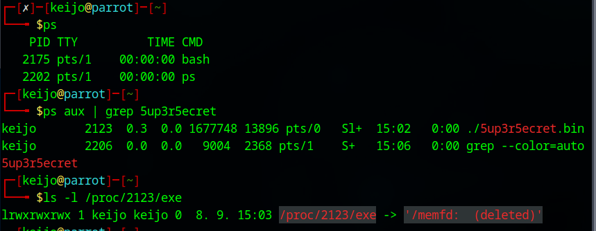

  

<em>Mythic C2 Framework – login page</em>

# Thesis

As part of my Bachelor's degree, I am required to complete a thesis — and what could be a better topic than one related to cybersecurity and red teaming, two of my biggest passions!

I chose Mythic C2, a modular and extensible command-and-control framework, as the focus of my thesis. I initially considered using Havoc for my thesis, but ultimately decided to focus on Mythic instead.

Official Mythic C2 documentation: [Mythic C2 Docs](https://docs.mythic-c2.net/home)

I try to update this page as my thesis work progresses. 

## Updates

14.09.2025 - First update and introduction to my thesis

18.09.2025 - Second update

One of the attack simulations of my thesis project, I successfully achieved what is known as fileless execution, as evidenced in the attached image. In short, this technique involves executing malicious code directly from memory without writing any files to disk. Practically, the attack payload was loaded, unpacked, and executed on the target system using Linux’s memfd_create function, which enables fully fileless operation—leaving no persistent traces on the system. This advanced attack method poses a significant challenge to traditional security mechanisms.
