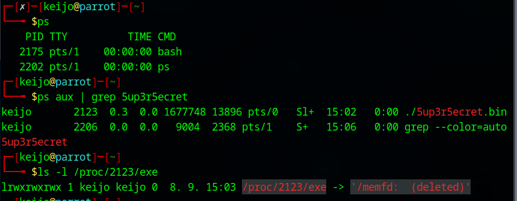

<link rel="stylesheet" href="{{ '/assets/css/mythic.css' | relative_url }}">

  

<em>Mythic C2 Framework – login page</em>

<h1>Thesis</h1>

As part of my Bachelor's degree, I am required to complete a thesis — and what could be a better topic than one related to cybersecurity and red teaming, two of my biggest passions!

I chose Mythic C2, a modular and extensible command-and-control framework, as the focus of my thesis. I initially considered using Havoc for my thesis, but ultimately decided to focus on Mythic instead.

Official Mythic C2 documentation: <a href="https://docs.mythic-c2.net/home">Mythic C2 Docs</a>

  

    <iframe 
      src="{{ '/assets/Thesis/Opinnaytetyo_Oja_Jaakko_2025.pdf' | relative_url }}" 
      style="width:100%; height:80vh; border:1px solid #333; border-radius:4px;">
    </iframe>
  

  
My completed thesis in Finnish. I perhaps try to translate it to English in the future.

<h2>Updates</h2>

<strong>14.09.2025</strong> —— First update and introduction to my thesis

<strong>18.09.2025</strong> —— Second update

One of the attack simulations of my thesis project, I successfully achieved what is known as fileless execution, as evidenced in the attached image. In short, this technique involves executing malicious code directly from memory without writing any files to disk. Practically, the attack payload was loaded, unpacked, and executed on the target system using Linux’s memfd_create function, which enables fully fileless operation—leaving no persistent traces on the system. This advanced attack method poses a significant challenge to traditional security mechanisms.

<strong>21.09.2025</strong> —— Third update

  

<a href="https://github.com/hackerschoice/bincrypter" target="_blank">Bincrypter</a>

I used Bincrypter in my thesis. The screenshot shows how Bincrypter compresses and encrypts the file "supersecret.bin"! Highly useful tool for red-teamers.

<strong>15.10.2025</strong> —— Fourth update

Finishing touches for the thesis work. We have had course exams lately so the thesis work have slowed down a bit.

<strong>20.11.2025</strong> —— FINAL UPDATE

I have submitted my thesis for evaluation. I discussed it with my supervisor, and they recommended a grade of 5, the highest possible! This was a really interesting project for me and it has further increased my desire to learn more. Red teaming is truly my passion within cybersecurity.

